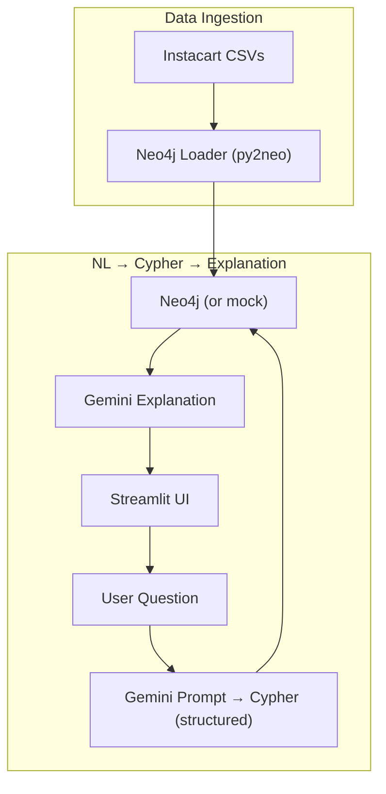

# Instacart Knowledge Graph Demo

> **Goal:** Answer natural‑language business questions about the Instacart Market‑Basket dataset by converting them to Cypher queries, executing them against a Neo4j graph, and returning results with Gemini‑generated explanations.

## Business Context

Retailers need to understand *product co‑purchase patterns* and *customer journey flows* to optimize cross‑selling, shelf placement, and recommendation strategies. This demo showcases a **Retrieval‑Augmented Graph** pipeline that:

1. **Ingests** the Instacart order data (CSV) and builds a Neo4j **property graph** (`Customer → Order → Product`).
2. **Generates** Cypher queries from free‑text user questions using Gemini Flash (`structured_output=True`).
3. **Executes** the Cypher against Neo4j (or an in‑memory mock graph) and formats results.
4. **Wraps** the raw result set in a human‑readable explanation generated by Gemini.

The pattern mirrors enterprise‑grade Graph‑AI solutions such as **Neo4j + LLM** used by large e‑commerce platforms.

---

## Data Source

**Instacart Market Basket Dataset** (Kaggle, CC0)

- **URL:** https://www.kaggle.com/datasets/psparks/instacart-market-basket-analysis
- **Format:** CSV files containing order history, products, and customer behavior
- **Size:** ~3M orders from ~200K customers across ~40K products
- **Includes:** `orders.csv`, `order_products.csv`, `products.csv`, `aisles.csv`, `departments.csv`

---

## Architecture Overview



### Core Components

| Component | Role | Implementation |
|-----------|------|----------------|
| **Neo4j Aura Free** | Hosted graph database with built‑in security and backups | Configured via `NEO4J_URI`, `NEO4J_USER`, `NEO4J_PASSWORD` in `.env` |
| **Mock Graph** | In‑memory NetworkX graph for offline demo (`DEMO_MODE=true`) | Provides same API surface as Neo4j driver |
| **Gemini Structured Output** | Generates valid Cypher syntax and a JSON schema for the query result | Prompt stored in `prompts.py` with Jinja2 templating |
| **FastAPI** | `/cypher` endpoint that returns the generated query, raw results, and explanation |
| **Streamlit** | Interactive UI for entering natural‑language questions and visualising results |

---

## Getting Started

### 1. Install Dependencies

```bash
cd vertex-ai-customer-demo
pip install -r requirements.txt
cp .env.example .env   # Add Neo4j credentials if you have a real instance
```

- With `DEMO_MODE=true` (default), the demo loads a **small pre‑built mock graph** – no external Neo4j needed.
- To use Aura, fill in `NEO4J_URI`, `NEO4J_USER`, and optionally `NEO4J_PASSWORD`.

### 2. Load the Graph

```bash
python -m demo_instacart_knowledge_graph.services.load_graph
```

The script parses `data/instacart_orders.csv` and creates nodes/relationships:

- `Customer` (id, location)
- `Order` (id, order_date)
- `Product` (id, name, aisle)
- `(:Customer)-[:PLACED]->(:Order)-[:CONTAINS]->(:Product)`

### 3. Run the API

```bash
make demo-4-api   # FastAPI on http://localhost:8004
```

Visit `http://localhost:8004/docs` for the OpenAPI UI.

### 4. Run the UI

```bash
make demo-4-ui    # Streamlit on http://localhost:8504
```

Enter a question, e.g.:

- *"What are the top‑5 most commonly bought product pairs?"*
- *"Which customers bought both almond milk and organic bananas?"*

---

## API Reference

### POST `/cypher`

**Request** (`application/json`):
```json
{ "question": "string" }
```
- `question`: Natural‑language business query.

**Response** (`200 OK`):
```json
{
  "cypher": "MATCH ... RETURN ...",
  "raw_result": [ { "product_a": "...", "product_b": "...", "count": 42 } ],
  "explanation": "The top‑5 product pairs are ... based on frequency of co‑purchase."
}
```

The `cypher` string is validated against a **Cypher schema** (`CypherResponse` Pydantic model) to ensure safe execution.

### GET `/health`

Simple health‑check returning `{ "status": "ok" }`.

---

## Implementation Details

### Graph Schema (Neo4j)

```cypher
CREATE CONSTRAINT ON (c:Customer) ASSERT c.id IS UNIQUE;
CREATE CONSTRAINT ON (p:Product) ASSERT p.id IS UNIQUE;
CREATE CONSTRAINT ON (o:Order)   ASSERT o.id IS UNIQUE;
```

### Gemini Prompt (Template)

```jinja2
You are a data analyst for an e‑commerce platform. Convert the following natural‑language request into a Cypher query that returns results matching the requested schema. Provide a JSON response with the schema:
{{ schema_json }}

User request: "{{ question }}"
```

The template is in `prompts.py`. The LLM is called via `shared/gemini_client.py` with `structured_output=True`.

### Error Handling

- **Neo4j connection failures** → fallback to the in‑memory mock (when `DEMO_MODE=true`).
- **Gemini JSON parsing errors** → return a 502 with a human‑readable fallback explanation.
- **Input validation** → FastAPI validates the request body length.

---

## Testing

```bash
make test   # Runs pytest suite for all demos
```

Key tests for this demo:
- `test_generate_cypher_success` – ensures a valid Cypher query is returned.
- `test_mock_graph_fallback` – verifies the mock graph is used when Neo4j is unreachable.
- `test_input_validation` – short questions return 422.

---

