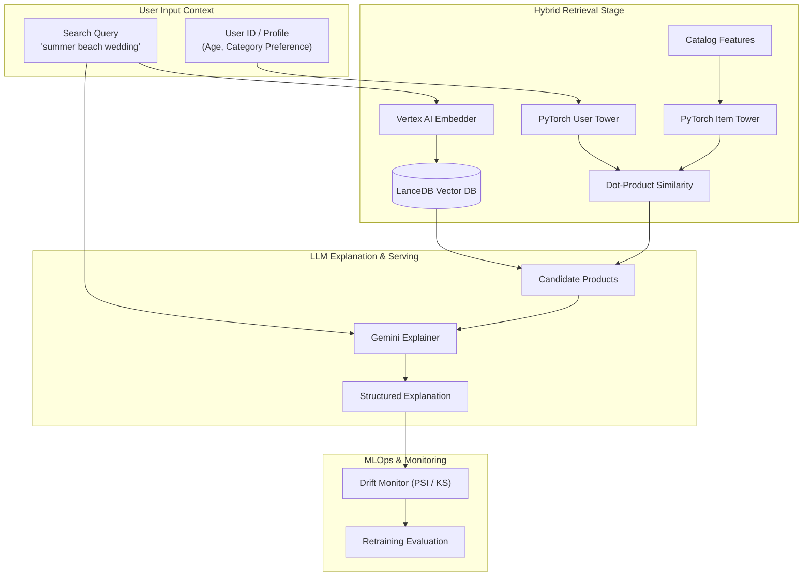

# Demo 2: Personalized Recommendation & Semantic Search Engine

> A hybrid recommendation system that combines personalized user-item collaborative retrieval (PyTorch Two-Tower) with zero-shot query understanding (vector search), using Google Gemini to explain the recommendation rationales.

## The Relatable Problem: "Shopper's Block"

You have a specific event in mind—like a "summer beach wedding" — and you go to an online store. However, traditional search bars force you to guess the exact keywords the retailer used ("floral", "midi", "chiffon") to find what you want. 

Furthermore, traditional recommendation engines (such as collaborative filtering) suggest items based on aggregate user behavior ("customers who viewed this also viewed..."). While effective for baseline association, these algorithms fail to capture user intent for long-tail queries, suffer from the "cold start" problem for new items, and fail to provide the reasoning behind their suggestions.

*This demo uses curated data inspired by the Kaggle **H&M Personalized Fashion Recommendations** dataset to address this challenge.*

## System Overview

To solve "Shopper's Block" and address these limitations, this system implements a hybrid recommendation and semantic pipeline with real-time explanation and active MLOps monitoring:

1. **Personalized Retrieval (PyTorch Two-Tower)**: Maps customer demographics and item attributes into a shared 64-dimensional embedding space, enabling sub-1ms candidate retrieval based on historical affinity and user features.
2. **Semantic Search via Embeddings (LanceDB)**: Converts product descriptions and queries into high-dimensional vectors via Google Vertex AI text embedding models, enabling conceptual matching for free-form search queries.
3. **Explainable AI (Gemini)**: Feeds retrieved products and the user query/profile to Gemini to generate structured, natural language explanations of why each item matches.
4. **Active MLOps & Optimization**: Monitors serving drift (Population Stability Index and Kolmogorov-Smirnov statistic), evaluates retraining triggers, and utilizes dynamic quantization (`torch.quantization.quantize_dynamic`) to reduce model storage by ~75% and optimize CPU inference.

### The Pipeline Architecture



## Example Input and Output

### System Input (Search Query & User Profile)
- **Search Query**: `"comfortable business casual clothes for office hot weather"`
- **User ID**: `42` (Favorite category preference: *Trousers*)

### System Output (Recommendation Result)
```json
{
  "recommendations": [
    {
      "product_id": "PROD-1092",
      "name": "Stretch Chino Trousers",
      "category": "Trousers",
      "price": 59.99,
      "similarity_score": 0.854,
      "explanation": "These trousers combine formal chino styling with moisture-wicking stretch cotton, matching your preference for trousers and your requirement for comfort in hot weather."
    }
  ]
}
```

### Demo Mode Fallback

To ensure the service runs anywhere without incurring cloud costs or requiring complex configuration, it defaults to `DEMO_MODE=true`:
- **Local LanceDB**: Runs completely in-memory/locally instead of relying on a managed cloud vector database.
- **Deterministic Mock Embeddings**: A custom hashing fallback for embedding generation when offline.
- **Mock Explanations**: Generates highly realistic heuristic-based explanations if a Gemini API key is not provided.
- **Local PyTorch Training**: Generates synthetic user-item interactions to train and test the Two-Tower model entirely on CPU.

## Technical Decisions & Trade-offs

| Approach | Advantages | Disadvantages |
|----------|------------|---------------|
| **SQL `LIKE` / Full-text** | Low implementation overhead, standard database feature | Incapable of matching synonyms or interpreting semantic intent |
| **Collaborative Filtering** | Captures complex collective patterns without text parsing | Suffers from cold-start problems and lacks explanation capability |
| **Vector Search (LanceDB)** | Captures semantic intent and matches across synonyms | Requires embedding computation and ignores user profile context |
| **Two-Tower Model (PyTorch)** | Sub-1ms personalized retrieval; handles cold-start via feature fallbacks | Requires training interaction history and regular model updates |
| **Hybrid Retrieval** ✅ | Combines personalized user preference with semantic search intent | Higher system complexity and multi-stage orchestration |

### Design Choice: LanceDB & PyTorch Two-Tower

- **LanceDB** was selected as the vector store because it is an Arrow-native, serverless, and lightweight database that runs in-process. This minimizes infrastructure overhead for development and deployment while maintaining rapid vector search capabilities.
- **Two-Tower PyTorch Model** allows the system to scale candidate retrieval to millions of items. By separating the user and item embedding pathways, user and item vectors can be pre-computed independently. Matching is reduced to a fast dot-product operation, enabling sub-1ms CPU inference.

### Solving the Cold-Start Problem
If a user is completely new (no purchase history and a new ID):
- **ID-Only Limitation**: A basic lookup model cannot generalize, as it lacks a trained embedding for the new `user_id`.
- **Feature-Based Fallback**: The Two-Tower model maps the unknown user ID to a reserved `<UNKNOWN_USER>` embedding and relies on customer demographic attributes (e.g., age, postal code, gender) fed into the MLP. The MLP maps these demographics to the shared vector space, allowing the model to make relevant recommendations even without historical context.

## Project Structure

```text
demo_recommendation_engine/
├── models.py             # Pydantic schemas (Product, RecommendationResult)
├── prompts.py            # Gemini prompt templates for explanation generation
├── services.py           # Business logic: Vector search, PyTorch client, & Gemini integration
├── backend.py            # FastAPI application with /recommend endpoint
├── frontend.py           # Streamlit dashboard UI (Discover, Catalog, and PyTorch tabs)
├── pytorch_client.py     # Local wrapper for model predictions & CPU training
└── pytorch_model/        # Core Two-Tower model implementation
    ├── pipeline.py       # Vertex AI Pipelines end-to-end ML workflow
    ├── compile_pipeline.py # Helper script to compile Vertex pipeline definitions
    ├── monitoring/
    │   └── drift_detector.py  # Population Stability Index (PSI) & KS drift metrics
    ├── retraining/
    │   └── trigger.py         # Retraining logic based on drift and stale thresholds
    ├── serving/
    │   └── predictor.py       # Vertex AI Custom Container predictor contract
    └── training/
        ├── data.py            # Datasets, splits, and synthetic generation
        ├── model.py           # TwoTower neural network architecture
        └── train.py           # CPU training loop, quantization, and evaluation
```

## Running Locally

```bash
# Terminal 1 — API Backend
make demo-2-api          # Runs on http://localhost:8002

# Terminal 2 — UI Frontend
make demo-2-ui           # Runs on http://localhost:8502
```

### Command Line Training
To trigger training of the Two-Tower model from the command line:
```bash
python -m demo_recommendation_engine.pytorch_model.training.train --demo --output-dir demo_recommendation_engine/pytorch_model/output --epochs 5
```

## Production Evolution Path

1. **Vertex AI Pipelines**: Compile and run the end-to-end training and evaluation workflow defined in `pipeline.py` on Vertex AI Pipelines for continuous integration/deployment.
2. **Vertex AI Custom Prediction Containers**: Package the `predictor.py` serving code into a custom container and deploy to a **Vertex AI Endpoint** for managed autoscaling and sub-10ms serving.
3. **Managed Vector Search**: Transition from local LanceDB to **Vertex AI Vector Search** for billion-scale indexing and high-throughput semantic retrieval.
4. **Hybrid Search Integration**: Combine dense vector retrieval with sparse keyword search (e.g., BM25) to handle exact alphanumeric strings (such as parts and specific SKUs) alongside general queries.
5. **Real-time Drift Alerts**: Connect the drift detection logs (PSI/KS scores) to Cloud Logging and Cloud Monitoring to trigger the retraining pipeline automatically.
