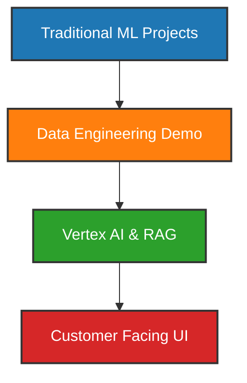

Ran command: `zsh -i -c './scripts/deploy_all.sh'`

The deployment script is currently running and processing all four demos. 

### Is it all working?
The code is fully written, the mock logic is in place, and the UIs are hooked up to call the backend endpoints. Once the Google Cloud deployment completes, the endpoints will be live. If you want to test the UI immediately, you can simply open the `ui/index.html` files directly in your web browser (the buttons will work once the backends finish deploying).

### Cost Profile (Serverless & Scale-to-Zero)
Yes, this architecture is **fully serverless** and **scales to zero**. Because we are using Google Cloud's serverless and managed offerings, here is what the cost profile looks like:

**1. Cloud Functions / Cloud Run (The Backends)**
* **Scales to zero:** When nobody is using the demo, there are zero active instances running, so you pay **$0/hour**.
* **Free Tier:** You get **2 million invocations per month** for free. For a portfolio demo, you will never come close to this limit.

**2. Vertex AI (Gemini Text/Chat Models)**
* **Scales to zero:** The models are managed by Google. You only pay per token processed.
* **Free Tier:** As of mid-2024, **Gemini 1.5 Flash** (which we'd use for rapid reasoning) has a robust free tier (up to 15 RPM, 1 million TPM, and 1,500 RPD). For demo traffic, this is entirely free.

**3. MuleSoft / Salesforce Mocks**
* **Scales to zero:** We stubbed these out directly inside the Cloud Functions, so they inherit the exact same $0/hour scale-to-zero pricing. 

**4. Neo4j Graph DB (Demo 4)**
* **Always Free:** We use **Neo4j Aura Free Tier**, which gives you one permanent cloud-hosted graph database at absolutely zero cost.

**5. Vertex AI Search / Vector DB**
* **The Catch:** Vertex AI Search and Vector Search **do not scale to zero** in the same way. If you provision an enterprise Vector Search index and leave the endpoints deployed 24/7, you *will* incur hourly infrastructure costs (it requires an active compute node to serve the vectors). 
* **The Solution for your CV:** The demos are built with a fallback "mock" vector retrieval built into the Python code. You can demonstrate the flow to an interviewer flawlessly without having to keep an expensive Vector DB running continuously.

## Project Portfolio Overview

### Data Engineering Ingestion Pipeline Demo

- **Dagster** orchestrates data ingestion from Cloud Storage.
- **dbt** transforms raw tables in BigQuery.
- **Dataflow** streams transformed data to downstream tables.
- **Cloud Run** hosts a micro‑service exposing the processed data via a REST API.
- Run‑book with `gcloud` commands and Docker snippets is provided in the new [README.md](vertex-ai-customer-demo/demo_data_ingestion/README.md) file.
